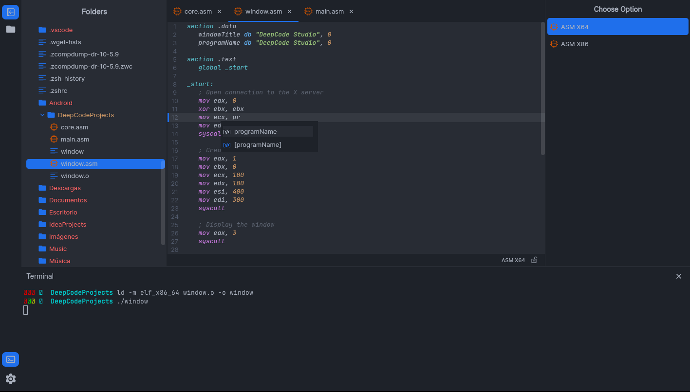
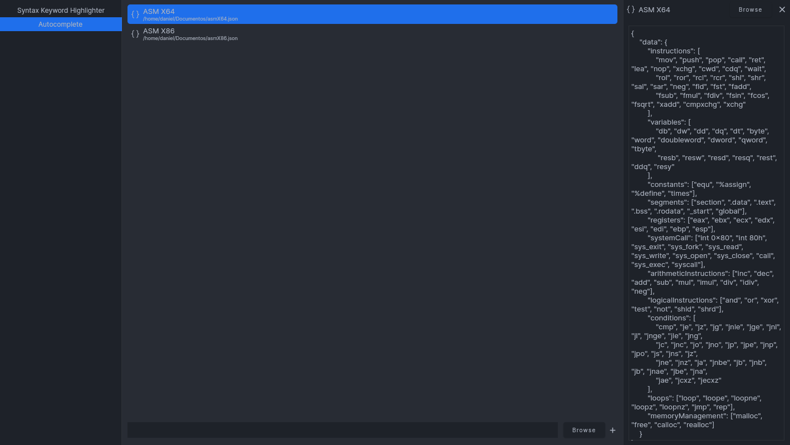
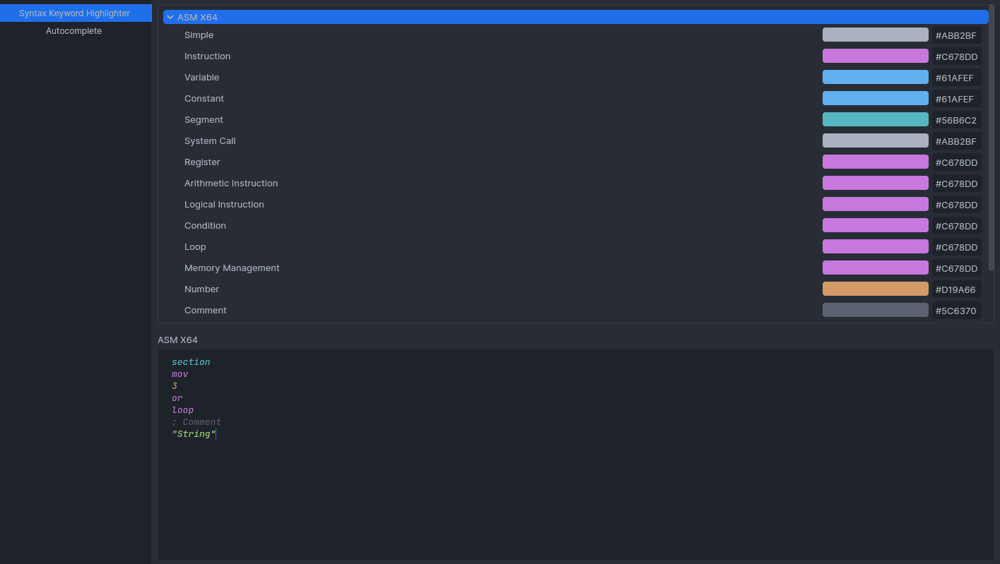

<div align="center" class="tip" markdown="1" style>


## DeepCode Studio

Assembly code editor, compatible with a wide range of assembly languages, designed to provide a seamless experience in both Windows and Linux environments.


</div>

## ⚙️ Autocomplete and syntax highlighting configuration
DeepCode Studio uses JSON files for configuring code autocompletion and syntax highlighting. This JSON file needs to be inserted into `Settings -> Autocomplete`.



> [!IMPORTANT]
> The JSON file must have the following structure:
> ```json
> {
>   "data": {
>     "instructions": [ ... ],
>     "variables": [ ... ],
>     "constants": [ ... ],
>     "segments": [ ... ],
>     "registers": [ ... ],
>     "systemCall": [ ... ],
>     "arithmeticInstructions": [ ... ],
>     "logicalInstructions": [ ... ],
>     "conditions": [ ... ],
>     "loops": [ ... ],
>     "memoryManagement": [ ... ],
>   }
> }
> ```
> If the provided JSON file does not have the aforementioned structure, DeepCode Studio will automatically delete this configuration.
### Example:
```json
{
    "data": {
        "instructions": [
            "mov", "push", "pop", "call", "ret", "lea", "nop", "xchg", "cwd", "cdq", "wait",
            "rol", "ror", "rcl", "rcr", "shl", "shr", "sal", "sar", "neg", "fld", "fst", "fadd",
            "fsub", "fmul", "fdiv", "fsin", "fcos", "fsqrt", "xadd", "cmpxchg", "xchg"
        ],
        "variables": [
            "db", "dw", "dd", "dq", "dt", "byte", "word", "doubleword", "dword", "qword", "tbyte",
             "resb", "resw", "resd", "resq", "rest", "ddq", "resy"
        ],
        "constants": ["equ", "%assign", "%define", "times"],
        "segments": ["section", ".data", ".text", ".bss", ".rodata", "_start", "global"],
        "registers": ["eax", "ebx", "ecx", "edx", "esi", "edi", "ebp", "esp"],
        "systemCall": ["int 0x80", "int 80h", "sys_exit", "sys_fork", "sys_read", "sys_write", "sys_open", "sys_close", "call", "sys_exec", "syscall"],
        "arithmeticInstructions": ["inc", "dec", "add", "sub", "mul", "imul", "div", "idiv", "neg"],
        "logicalInstructions": ["and", "or", "xor", "test", "not", "shld", "shrd"],
        "conditions": [
            "cmp", "je", "jz", "jg", "jnle", "jge", "jnl", "jl", "jnge", "jle", "jng",
            "jc", "jnc", "jo", "jno", "jp", "jpe", "jnp", "jpo", "js", "jns", "jz",
            "jne", "jnz", "ja", "jnbe", "jb", "jnb", "jb", "jnae", "jbe", "jna",
            "jae", "jcxz", "jecxz"
        ],
        "loops": ["loop", "loope", "loopne", "loopz", "loopnz", "jmp", "rep"],
        "memoryManagement": ["malloc", "free", "calloc", "realloc"]
    }
}
```

In `Settings -> Syntax Keyword Highlighter`, we can customize the colors for syntax highlighting:



